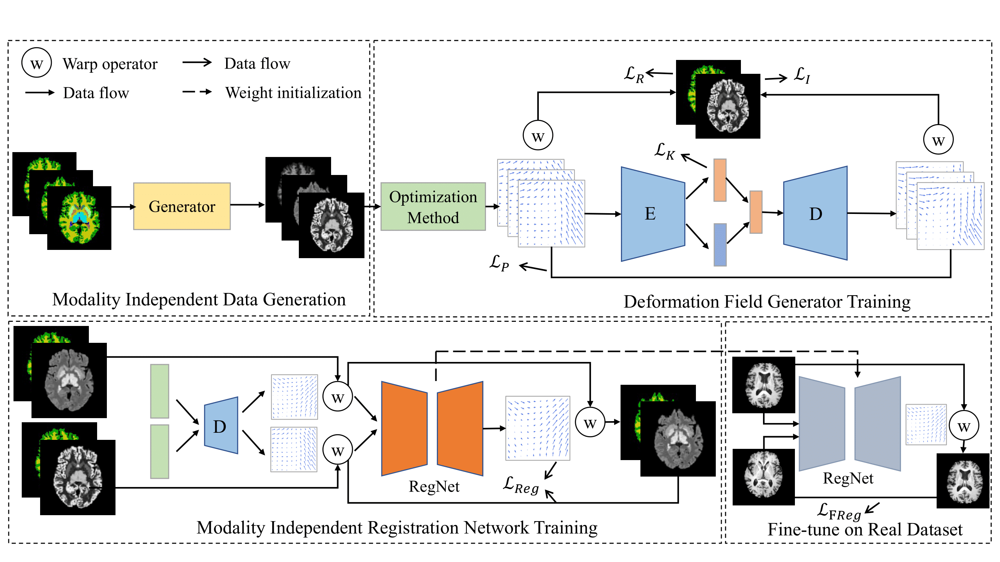
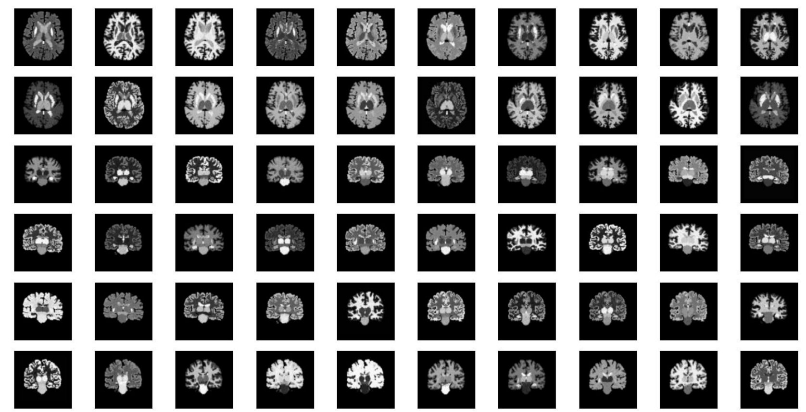
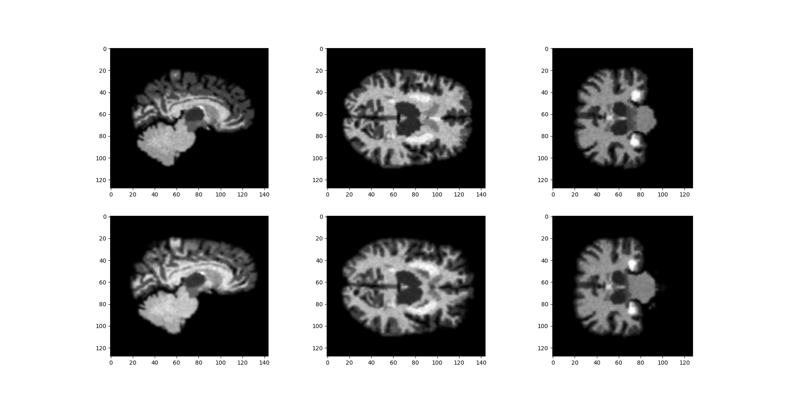

# The repo is for Nonfinite-Modality Data Augmentation for Brain Image Registration (SMIBID)

## Description
This dataset is mainly for brain image registration tasks (may be used for other tasks, e.g., segmentation...). We used the whole-brain segmentation masks to generate modality-independent brain images and trained a VAE to generate the deformation vector field. We can use the dataset to augment real datasets. Due to the limitation of upload files, the data is part of our whole dataset. If you need the whole dataset, please use git issues to contact with me or you can use the code to generate your dataset.

## Requirement
```
scipy==1.6.2
numpy==1.20.2
pandas==1.2.3
torch==1.7.1
matplotlib==3.4.1
SimpleITK==2.0.2
```
## Usage
You can simply run the Demo.py. (Make sure you have already installed these packages)
```
python Demo.py
```

## Whole Pipline


## Generated Image


## Generated Deformation


## File/Folder Description
- datashow.pdf show some generated images
- Dataset folders are masks and generated images (parts due to limitation)
- Data images folder show some slices of images
- Demo.py show how to generate images and DVFs
- DVFGenerator.py is for DVF generation
- ImageGenerator.py is for image generation
- utils.py contains tool method
- vanilla_vae.py is the VAE model

## Cite
Now the paper is under review (Journal of Biomedical and Health Informatics)

## Acknowledgement
- https://github.com/AntixK/PyTorch-VAE
- https://github.com/voxelmorph/voxelmorph
- https://github.com/airlab-unibas/airlab